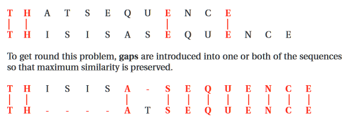
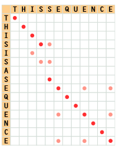
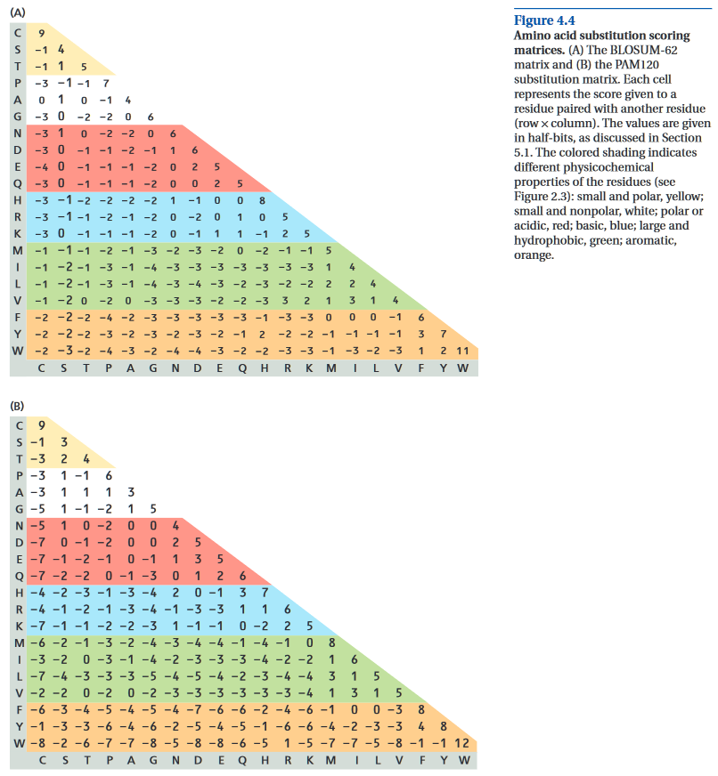

# Reading Response: UB Ch 4.1-4.4
-----

###### Notes:

**Principles of Sequence Alignment**

- comparing sequences are challenging not b/c of the amount of info available for searching, but rather the many ways DNA and protein sequences can change during evolution.
- **pseudogenes** - case where mutation disables one copy of a gene so that it is no longer expressed, or if transcribed, does not produce a func. protein.
    - can be found in homology searches
- **alignment** is the task of locating equivalent regions of 2+ sequences to maximize their similarities.
    - bc of mutation, seq. from the same protein or gene from 2 closely related species are rarely identical
    - when sequences are of different lengths, **gaps** are introduced to maximize similarity
        - penalized in the scoring process
    - alignments can be due to chance or due to relation  
    

- **similarity** vs **homology**
    - similar is broad
        - can be a result of **convergent evolution**
    - homology has distinct evolutionary and biological implications

- think mutations as classes **implementing/inheriting** another class

- it's easier to detect homology when comparing protein seq. than when comparing nucleic acids
    - 4 letters in DNA vs 20 in protein
        - the 20 in proteins allow for more ID & info
    - the degree of similarity, as judged by some appropriate quantitative score, needs to be greater between DNA sequences than between protein sequences for the alignment to be of importance.

**Scoring Alignments**

- no scoring model is perfect
    - be careful about the results

- **Percentage Identity**
    - divide the num. of id. matches by the total length of the aligned region and * 100
    - does not give a complete picture
        - significance of the bases in DNA or amino acids in protein are not accounted for
- **Dot plots**  

    - looks like an [sparse] identity matrix -- sorta

- there's a min. %age ID that can be accepted as significant
    - 20%-30% sim. --> **twilight zone**, homology *may* exist
    - < 20% --> **midnight zone**

- **Distance measuring**
    - the lower, the better
    - the measure of diff. b/t 2 homologous seq. fromm diff. species' sometimes called **genetic** or **evo. dist.**

**Substitution Matrices**

- for alignments of protein's amino acids
- the choice of which sub. matrix to use is hard bc there is no correct way
- most scoring schemes for AA seq. use a 20x20 matrix. Each cell of the matrix is occupied by a score rep. the likelihood that the particular pair of AA will occupy the same pos. through true homology, compared to the likelihood of their occurring as a random match.
- Values are summed into score **S**

- PAM (Point Accepted Mutations) sub. matrix use sub. freq. derived from sets of closely related protein seq.  

- BLOSUM sub. matrices use mutation data from highly conserved local regions of seq.

- the choice of sub. matrix depends on the problem to be solved.
    - PAM indicates evo. dist.
    - BLOSUM refers to %age identity
    - there are other matrices specially curated for special problems

- the shorter the length, the higher the score to be accepted

- **Gaps inserted in a sequence to maximize similarity with another require a scoring penalty**
    - bc you can add as many gaps as you want :kek:
    - gap penalty [value] is determined by the user
        - stricter --> higher penalty
        - lax --> lower

- **Dynamic programming algorithms** can determine the optimal introduction of gaps.
    - precise behavior of the alg. is established only when it runs bc it depends on the sequences being aligned
    - actual values of the gap scores can be varied depending on the type of scoring mat. used
    - gaps must never align w/ ea. other