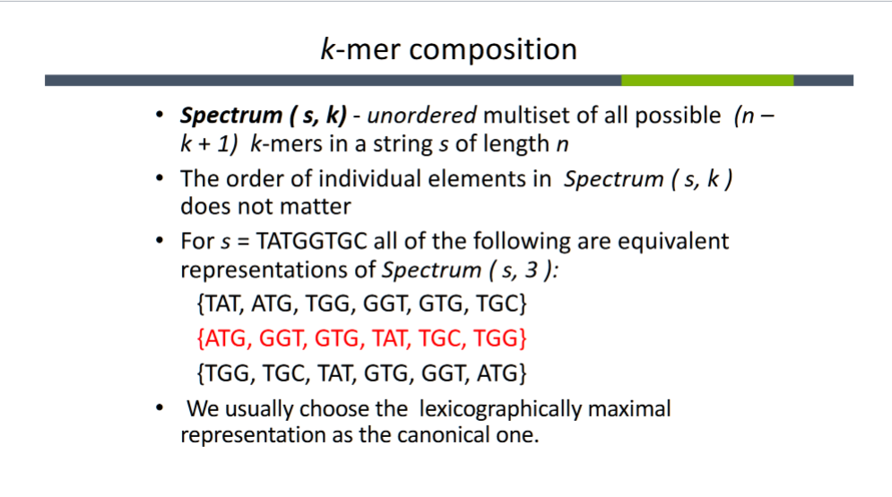

**Class Notes**

- Shortest Superstring Problem (SSP)
    - Given a set of strings, find the shortest string that contains all of them
    - Input: substrings s1 ... sn
    - Output: A string s that contains all strings

- SSP can be reduced to Traveling Salesman Problem (TSP)

- Sequencing by Hybridization (SBH)
    - Attach all possible DNA probles of length *k* to a flat surface, each probe at a distinct and known location (DNA Array).
    - Apply a solution containing fluorescently labeled DNA fragments to the array.
    - The DNA frags hybridizes w/ those probes that're complementary to substrings of length *k* of the fragment.
    - Using a spectroscopic detector, determine which probes hybridize to the DNA frag. to obtain the *k-mer* comp. of the target DNA frag.
    - Use TSP to remake the seq. of the target DNA frag from the *k-mer* comp.

  

- Can 2 diff. seq. have the same spectrum?
    - Yes
        - AAGAAAAAA
        - AAAAAAAAG

- discussion about constructing de Brujin graphs
    - hacks to handle repeats and non-eulerian graphs