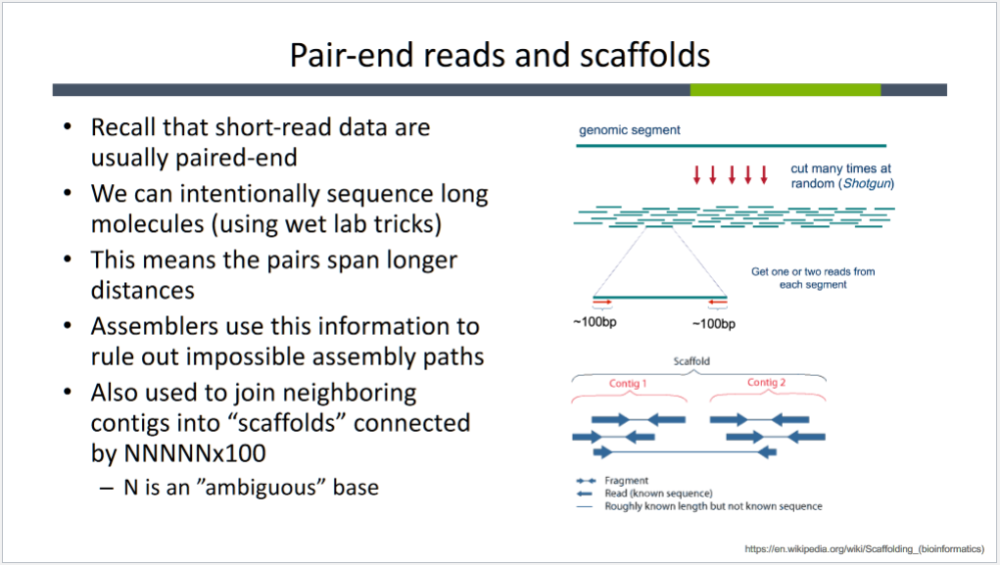

**Class Notes**

- Polishing assemblies
    - long and short read data may be combined
    - short read illumina may be used to "polish" the long-read PacBio/Nanopore assembly
        - align short read data to assembly
        - correct sequencing errors
            - polymorphisms/SNPs
            - InDels
        - correct assembly errors
            - detect possible missaemblies
    -most common tool is *Pilon*

- Evaluating assemblies
    - number of contigs (ideal # is 1)
    - longest single contig
    - N50: 50% of assembly is contained in contigs N50 or longer
    - L50: How many contigs does it take to cover 50% of assembly? (ideal is #?)
    - can compare to similar genomes to estimate completeness

    - **Example:** [500, 1000, 2000, 5000, 6000] ==> **14500** total
        - What's the longest contig?
            - **6000**
        - What is the N50?
            - 5000 + 6000 = 11000, therefore **5000**
        - What is the L50?
            - **2** (5000 + 6000)

- How are these trees built from DNA seq.?
    - leaves represent existing species
    - internal verts are ancestors
    - root represents the oldest evo ancestor

- outgroup: evolutionary distinct from the rest of the tree
    - e.g. adding a mouse in a tree with humans and other primates

- the root and ***only the root*** can have three children?  

- Phylogeny options
    - Naive clustering (UPGMA)
        - bad due to being ultrametric (fixed evo rate)
    - Parsimony
    - Max likelihood
    - Neighbor joining