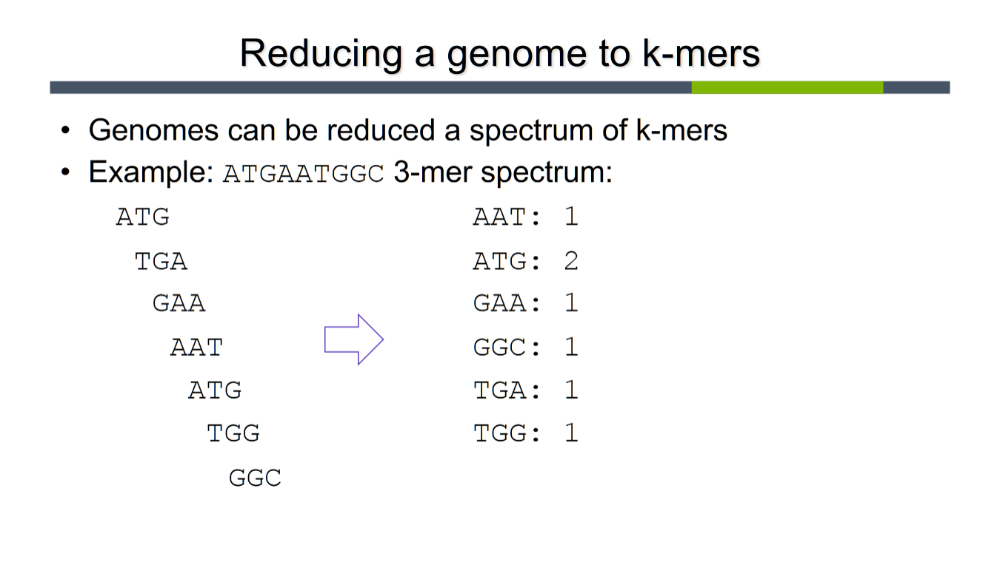

**Class Notes**

**Using k-mers for search**
- a k-mer is a stretch of *k* nucleotides or AA
    - 1-mer
    - 2-mers (aka dinucleotides)
    - 3-mers (aka trinucleotides)
        - codons for AA
    - 4-mers (aka tetranucleotides)
        - poorly understood, but commonly used for binning short assembled genome regions together into species-like bins
        - can be used to detect horizontal gene transfer
- genomes can be reduced to a *spectrum* of k-mers
    - don't care about frame shift -- every k-mer counts  

  

- k-mers can be stored efficiently using hash tables
    - key: genome
    - list of possible k-mers and its respective frequencies?
    - ***Jellyfish*** is a fast parallel tool to count kmers
    - ***Kraken*** tool hashes k-ers to taxonomy nodes
        - uses jellyfish as its kmer counting engine

**Minhash: K-mer based search/alignment**
- a wrapper on MASH?
- *Jaccard* index
    - ratio of the intersection to the union of a set
- **MASH**
    - has all words in doc
    - keep smallest *s* hashes, numerically (the "sketch")
    - calc Jaccard ind. of any 2 sketchces
    - the larger the value, the more acc.