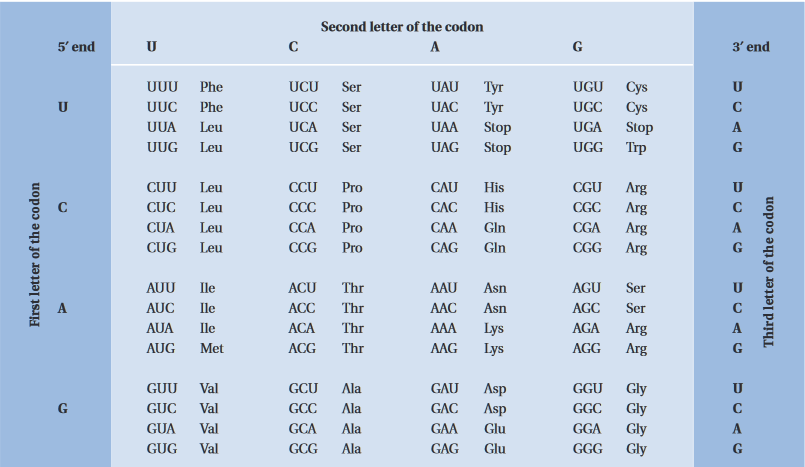
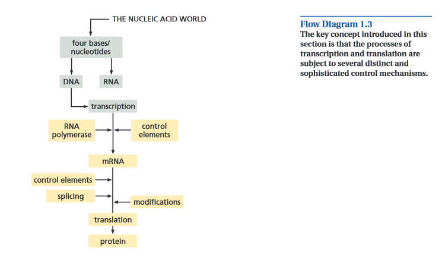
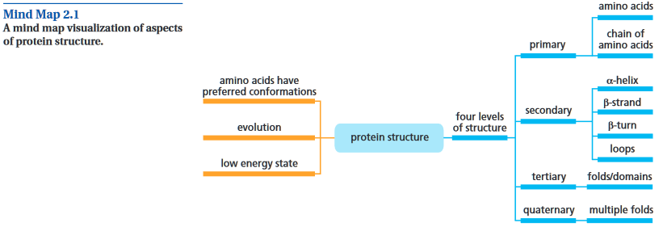

# Reading Response: UB Ch 1-2; Skim UB Ch 3 Notes
-----

### Chapter 1:

- State the chemical structure of nucleic acids
- Explain base-pairing and the double helix
- Explain how DNA stores genetic info
- Summarize the intermediate role of mRNA b/t DNA and proteins
- Outline how mRNA is translated into proteins by ribosomes
- Outline how gene control is exercised by binding to short nucleotide sequences
- Show that eukaryotic mRNA often has segments (introns) removed before translation
- Discuss how all life probably evolved from a single ancestor
- Summarize how evolution occurs by changes to the sequence of genomic DNA

###### Notes:

- linear encoding of 4 base units of the DNA molecule
- nucleic acid:
    - DeoxyriboNucleic Acid (DNA)
    - RiboNucleic Acid (RNA)
- Main role of **DNA** is info storage
    - in all living cells
    - chemical structure
- DNA can change its info-coding and func. properties over time b/c of **mutations**
- **Genome**: set of DNA molecules
    - 46 in humans -- 1 in ea chromosome
- **Proteins** are made using info encoded in DNA. Processes essential to life such as energy metabolism, biosynthesis, and intercelluar comm. are done via agency of proteins.
- a gene is the info in DNA that directs the manufacture of a specific protein or RNA molecular form.

**Structure of DNA and RNA:**
- DNA molecules are linear polymers of 4 different **nucleotide** building blocks whose differences are restricted to a substructure called the **base**.
- **nucleotide sequence** or **base seq.** of DNA encodes info for making proteins
- RNA molecules are also linear polymers, but are much smaller than genomic DNA.
- Also contains 4 diff. base types
- **Nucleotides** are the building blocks DNA & RNA
    - consists of a nitrogen-containing base
    - **deoxyribonucleotides**
    - **ribonucleotides**
- In DNA, 4 different bases occur:
    - purines:
        - **G**uanine
        - **A**denosine
    - pyrimidines:
        - **C**ytosine
        - **T**hymine
- RNA similar except T is replaced w/ **U**racil
- **Genomic imprinting** - changes that occur in the offspring based on whether the gene is maternally or paternally inherited.
- the class of RNA molecules is called **tRNA**
- **Watson-Crick base pairing**
    - A-T
    - C-G
    - Antiparallel, running in opposite directions
        - AAG --> CTT , ***NOT*** TTC
- **DNA replication**
    - When DNA molecules are copied for cell division
- DNA has few errors as it's important for subsequent generations
    - What happens when AAG --> CT_?
- **Hybridization** - DNA being able to pair with DNA or RNA complementary seq. to make a double DNA or D/RNA hybrid
    - used for **mircroarrays**

- Almost all RNA molecules in living systems are single stranded
    - i.e. more flexibility
    - can act as enzymes, catalyzing particular chem. reactions.
    - short stretches of RNA are almost/exactly complementary to others
        - can interact w/ea. other to for something similar to DNA (**RNA secondary struct**)

- Proteins are the main working components of organisms
    - Not all genetic info in DNA encodeds proteins

- A **gene** is considered to also include surrounding regions of noncoding DNA that act as control regions
    - How can you tell if something is a gene?
        - start and stop codon
        - match database of known genes
        - certain length range
        - certain patterns at start to encourage polymerase to bind and transcribe

- **Analogies**
    - Genome ~= Binary
    - Codons ~= Assembly
    - Proteins ~= Classes w/ functions and states

- THE NUCLEIC ACID WORLD
    - --> DNA
        - --[transcription]--> m(essenger)RNA
            - --[translation]--> protein
    - --> RNA

- proteins are made from **amino acids**
    - ~20 diff kinds of AA

- mRNA is translated into protein according to the genetic code
    - rules governing the correspondence of the base sequence in DNA or RNA to the amino acid sequence of a protein.  

    

- the 3-base sets in RNA are called **codons**

- genetic code is **degenerate**, in that most amino acids can be specified by more than one codon
    - can deduce the protein seq. from DNA/RNA seq., but cannot unambiguously deduce a nucleic acid seq. from a protein seq.

- there are 3 codons that signals the end of a protein-coding seq. (**stop codons**)

- **O**pen **R**eading **F**rames

- RNA mainly involved in transferring info from DNA and the use of this info to make proteins
    - 3 types:
        - mRNA
        - r(ibosomal)RNA
        - t(ransfer)RNA

- mRNA produced by transcription is trnaslated into protein by ribosomes  

- **eukaryotes**
    - Organisms (single-celled like protozoa or multi-celled like humans) that have their DNA packaged inside a nucleus
- **prokaryotes**
    - A (slightly controversial but) simple term used to refer to single-celled organisms that don’t package their DNA inside a nucleus
- **intron**
    - DNA in a gene that gets transcribed into mRNA, but then spliced out of the final mRNA before getting translated to protein
- **exon**
    - DNA in a gene that isn’t an intron (i.e. it stays in the mRNA and eventually becomes translated into part of a protein)
- **splicing**
    - In Eukaryotes, genes have some regions of DNA (see “introns”) that get taken out of the mRNA before making protein
    - This process of removing the introns and connecting the exons together is called “splicing”
    - Splicing doesn’t always occur the same way for the same gene. You can get different arrangements of exons that produce different versions of the protein. 

### Chapter 2:

- Proteins have **four** main structures  

- some amino acids have uncharged side chains and are generally **hydrophobic**

- while other AA are **hydrophilic**

- AA are covalently linked together in the protein chain by peptide bonds

- proteins are linear polymers composed of amino acids. They have a complex struc-
ture that includes some more regular features. Large proteins consist of several
domains, each of which will have some regular secondary structures. The structures
form a scaffold on which the active groups are located, ready to bind ligands, or
carry information, and other roles in order for the protein to function properly.

### Chapter 3:

- skimmed it
- DB are used for key-value lookups and relational algebra is used to get info (**think CS 151 days**)