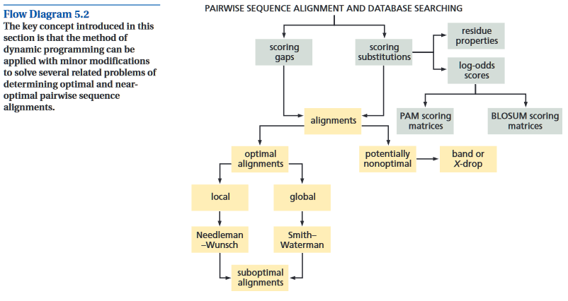
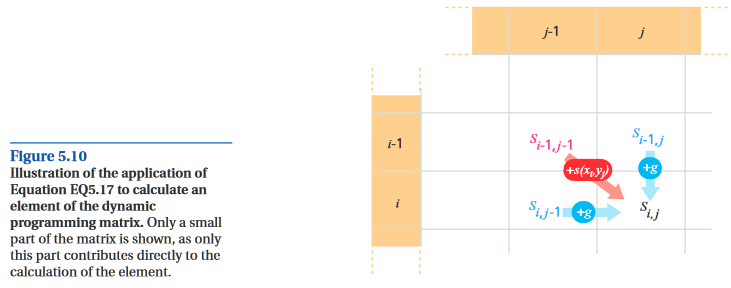
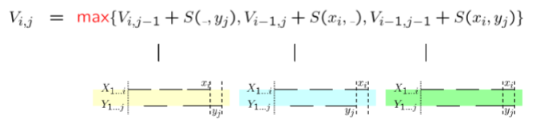
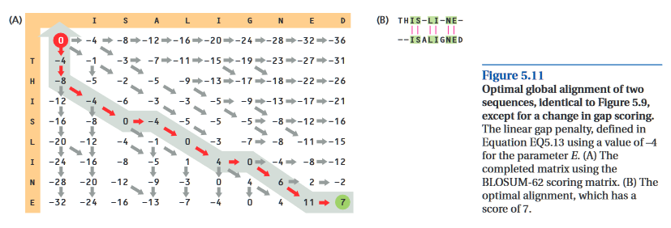
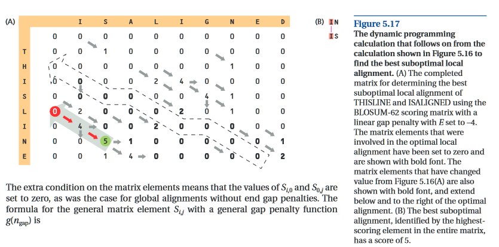
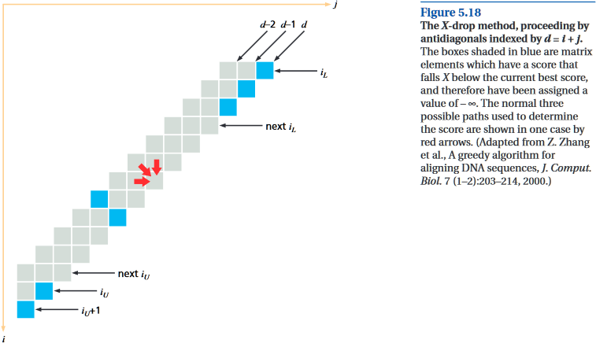
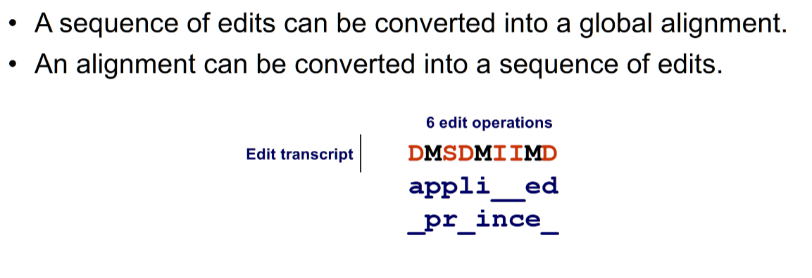
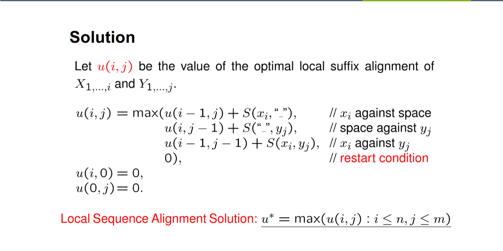

# Reading Response: UB Ch. 5.2 Notes

-----

##### Notes

**Dynamic Programming Algorithms**

- key property of dynamic programming (wrt alignment, at least) is that the problem can be divided into many smaller parts.  

- break it into pieces such that each have optimal alignments (i.e. they can't be rearranged for a better one)
    - sum scores from all pieces
    - until the global optimal alignment has been obtained, it is not known which bases are aligned.

**Optimal global alignments are produced using efficient variants of the Needleman-Wunsch algorithm**

- align sequence ***x*** and seq. ***y***
    - **x has 1-->m bases, and y has 1-->n bases**
    - the score will be assumed to be a measure of similarity (highest desired) --> max() scores
    - could also be for evo. dist. (lowest desired) --> min() scores
- matrix S(x, y)
    - m+1 rows and n+1 columns (the +1 is for gaps)

  

**EQ5.17:**
  

**NOTE:** How the horizontal and vertical movements correspond to blanks in (B)

- After filling out matrix S, do a traceback wherein from S(m,n), follow the arrows back through the matrix to the start.

- There may be more than one optimal alignment?

- A simple change to the algorithm allows seq. to overlap ea. other at both ends of the alignment w/o penalty (**semiglobal alignment**).
    - In this way, better global alignments can be obtained for sequences that're not the same length.
    - Set Si,0 and S0,j to 0 instead of a penalty value.
    - Instead of traceback to the beginning, start at the highest-scoring element in the bottom or right-most column.

- The above algorithms assume a linear penalty

**What about non-linear penalties?**

- fill this part in class

**Local and suboptimal alignments can be produced by making small mods to the DP alg.**

- finding the high-scoring zone of a subset of the seq.
- key difference in local vs. global is that whenever the score of the optimal sub-seq. alignment is < 0, it is rejected and set to 0.
    - score must be positive
- traceback from the highest element wherever it occurs  

- Sometimes it is of interest to find other high-scoring loval alignments
    - presence of repeats
        - these will have a high degree of overlap with the opt. alignment, however, and contain little, if any, extra info beyond that given by the optimal local alignment.

**Saving space by throwing away intermediate calcs.**
- key to this algorithm is to notice that the calculation of any element only req. knowledge of the results for the current and previous row.

**Time can be saved with a loss of rigor by not calculating the whole matrix**  

- fill the rest of the notes in class

**Class Notes**

- When you go left or right in the matrix, you "add" the origin with the penalty value
    - o.w. you refer to the matrix

- Start-space free variant
    - 1st row and cols are filled with 0s
- End-space free variants
    - when calculating last row and col, penalty is 0
- both start and end free?
    - do both

- Global
    - 1:1 length match
- semi-global
    - one of the string fits into the other, which is greater in length than the former
- local
    - subsets within both strings

- **Edit distances**
    - Looking at what it'll take to transform **X** into **Y**
    - Operations:
        - [I]nsertion, [D]eletion, [S]ubstitution
        - [M]atch (no edit is performed)
    - Optimal edit distance is the **Levenshtein distance**
        - Least number of edits (& highest score? because we can just spam [S])

- Smith-Waterman algorithm for finding local alignments  

  

