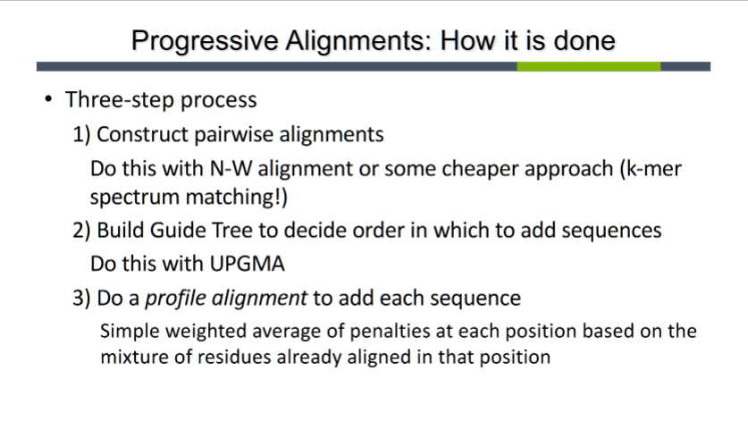
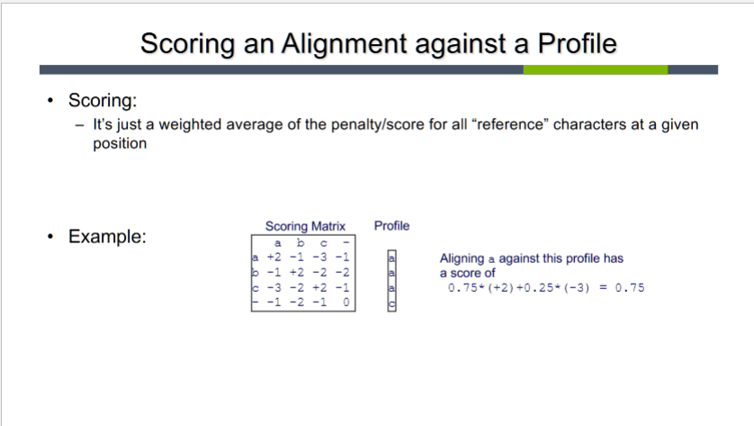

# Reading Response: UB Ch 6.1-6.2
-----

###### Notes: ######

**Profiles and Sequence Logos**

- Profile
    -  general properties of the set of sequences such that the new sequence can be aligned to this representation
    - can be constructed using dynamic programming

- Iterated sequence search (ISS)
    - performing several searches with diff fam mems in the hope that members will be identified by at least one of the searches. When fam examples used for further searches have been detected in the initial query-seq. search and each newly discovered qu. is used in a further query.

- Position-specific scoring matrices (PSSM)
    - Weighting scheme:
        - Sibbald and Argos

- Dirichlet mixture | Dirichlet dist. densities

**Profile Hidden Markov Models**

**10/2/2023 Class Notes**

- Positive strand RNA viruses
- Negative "                "
- Double-stranded "         "

- DNA: Nucleotide/base
- AA:  Residue

- PSSMs (Position-specific scoring matrices)
- This is essentially the “profile” alignment but with some slightly more sophisticated probability estimation

- Progressive alignments:
    - Start with 2 seq. and progressively new sequences into the MSA
    - heuristic alg. -- not optimal
    - 3 step process:
        - Construct pairwise alignments
        - Build guide tree to decipher order in which to add seq.
        - Do a *profile alignment* to add each seq.  

          
    
- Guide trees

(((v1,v3), v4), v2)  

- Use Hidden Markov Models to align against a profile while taking into account dependencies b/t pos. in the seq.
    - e.g. what if the likelihood of a certain pos. @ pos.100 depends on wther there was a certain mutation @pos.90?

- HMM
    