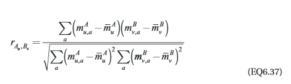

# Reading Response: UB Ch 6.3
-----

###### Notes: ######

- Aligning 2 PSSMS (pos. spec. scoring matrix) or profile HMMs can be more effective at identifying remote homologs and evolutionary links b/t protein fams.

**Comparing two PSSMs by alignment**

- the alignment of 2 PSSMs cannot proceed by a standard alignment technique
- LAMA (Local Alignment of Multiple Alignments)
    - does not allow any gaps in the alignment of PSSMs
    - **Pearson correlation coefficient**
        - method used to measure the sim. of two columns  
          
        - bars on top of Ms are means of the respective PSSM columns
        - summations are over all residue types *a*
        - total value ranges from 1 for identical columns to -1
        - as no gaps are permitted in aligning 2 PSSMs, all possible alignments can be readily scored by simply sliding one PSSM along the other, allowing for overlaps at either end of each PSSM. The highest-scoring alignment is then taken as the best alignment of the two families.
        - Shuffling (?)
            - preserves the overall residue comp of PSSMs
- prof_sim
    - allows gap insertion in PSSMs
    - uses Smith-Waterman local alignment technique
    - uses the original seq. alignments to define the AA dist. in ea. column
- COMPASS ([CO]mparison of [M]ultiple [P]rotein alignments with [A]ssessment of [S]tatistical [S]ignificance)
    - better than prof_sim
        - column residue dist. are calculated using sequence weights and pseudocounts similar to PSI-BLAST, except gaps are treated as another residue type
    - column comparisons are scored using a method related to log-odds
    - scores can be converted into *E*-values

**Aligning Profile HMMs**

- COACH ([CO]mparison of [A]lignments by [C]onstructing [H]MMs)
    - gap scoring is pos. dependent
- HHsearch  
  
    - used to identify very remote homologs
    - uses a variant of the Viterbi method