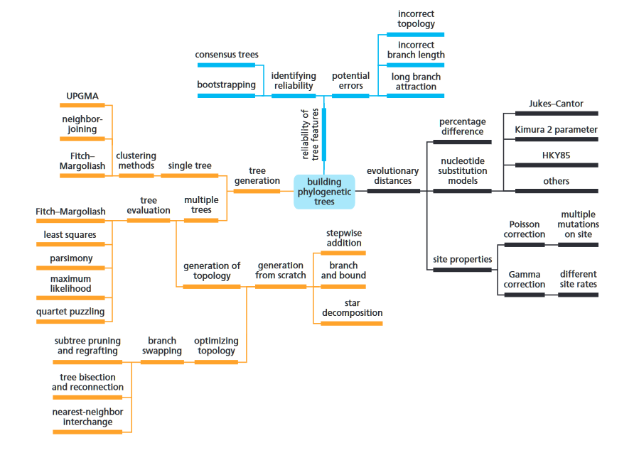
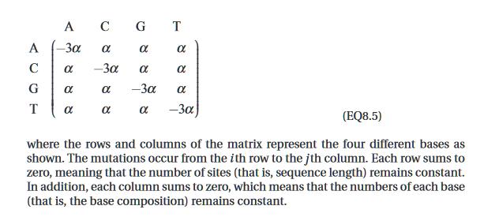
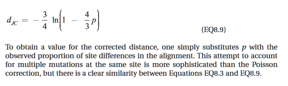

# Reading Notes: UB Ch 8.1-8.2 pg. 267-285 only, 8.3 pg. 291-293 only
-----

###### Notes:

-----

###8.1

A mind map representation of the techniques involved in building phylogenetic trees, incuding tree generation, calculation of evolutionary distance, and reliability of trees.

- Building Phylogenetic Trees
    - used to obtain estimates of the evolutionary distances b/t seq., and these dist. become the raw data for tree gen.

**A simple, but inaccurate measure of evo. dist. is the *p*-dist.**
- p = D / L
    - If an alignment of two seq. has L positions (w/o counting pos. at which one seq. has a gap), of which D differ, then the formula above follows.
- lack of considerationfor multiple substitutions
    - assumes that each site in the seq. has evolved independently, and doesn't consider the possibility of multiple subs at a single site.
- doesn't account for insertions and deletions

**The Poisson distance correction takes account of multiple mutations at the same site**
- modified p-dist.
- assumes that the num of subs at a site follows a Poisson dist., which implies that events occur independently and at a constant rate
- d = -ln(1-p)
    - d is the corrected distance
    - p is the uncorrected p-dist.

**The Gamma distance correction takes account of mutation rate variation at different sequence positions**
- accounts for rate hetreogeneity among different sites in a sequence alingment, which isn't accounted for in Poisson.
- allows for a more realistic representation of the evo. process, considering that diff. sites might have diff. rates of evo.
- d_gamma = a[ (1-p)^(-1/a) - 1 ]
    - ***a*** varies b/t .2 and 3.5
    - ***a*** determines the site variation

**The Jukes-Cantor model reproduces some basic features of the evolution of nucleotide sequences**
- includes the chemical nature of the sequences.
- makes a number of assumptions that're known to be incorrect in most cases, but has proved useful. Its simplicity allows the derivation for the evo dist. b/t two sequences.
- all sites are sassumed to be independent and to have identical mutation rates. furthermore, all possible nucleotide subs are assumed to occur aat the same rate alpha per time unit:  

  

**More complex models distinguish between the relative frequencies of different types of mutation**
- one improvement involves distinguishing between rates of transitions and transversions.
- one of the very common assumptions present in models of evolution is that seq. pos. behave identically and independently in respect to mutation.
- almost nosequence segments are truly random. however, they almost invariably exhibit some mutation correlation between positions.
    - hidden markov + gamma correction as a partial solution

**There is a nucleodtide bias in DNA sequences**

- nucleotide base comp is not uniform and can vary significantly. this variation is not solely dependent on thermal stability and temp., but may be influenced by other factors

- variation in base composition throughout evo. poses a challenge for realistic modeling. models can only provide partial solutions

- CG-rich and CG-poor regions (isochores) can have implications for the functional properties of the genome.

**Models of protein-sequence evolution are closely related to the substitution matrices used for sequence alignment**

-----
### 8.2
##### Generating Single Phylogenetic Trees

**Clustering methods produce a phylogenetic tree based on evolutionary distances**
    - There is no associated measure of how well the resulting trees fit the data, so that alternatives cannot be easily compared.
        - Not possible to test evolutionary hypotheses by comparing a particular tree topology with that identified by the method as the best.
    -Obtaining evolutionary distances have potential problems:
        - Alignments may contain errors, leading to incorrect dist.
        - assumptions (e.g. identical rates of change at all sites) made in evo. models may not hold for a particular data set.

**The UPGMA method assumes a constant molecular clock and produces an ultrametric tree**
    - downside in that it assumes a constant molecular clock
    - [U]nweighted [P]air-[G]roup [M]ethod using [A]rithmetic averages
    - trees produced by this method are rooted and ultrametric, and all the leaves are the same distance from the root
    - the two sequences with the shortest evo dist. bt them are assumed to have been the last to diverge, and must therefore have arisen from the most recent internal node in the tree
        - their branches must be of equal length, and so must be half their distance
    - sequences are grouped into clusters as the tree is constructed, with each cluster being defined as the set of all descendants of the new node just added.  

If the data being analyzed did not evolve under conditions of a molecular clock, the UPGMA tree could be seriously in error.

**The Fitch-Margoliash method produces an unrooted additive tree**
- doesn't make the assumption of a constant mutation rate, but does assume that the distances are additive.  

  

**The neighbor-joining method is related to the concept of minimum evolution**
- does not assume all sequences have the same constant rate of evolution over time.
- very effective at constructing trees for large datasets
    - not rooted and is additive
- Formula and example on pages 284-5 -- too big to snip and paste

-----

### 8.3

**Finding the root gives a phylogenetic tree a direction in time**
- often desirable to know where the root lies, so that all the branches can be assigned a direction in time
- several ways involve inexact assumptions -- ***unadvisable***
    - choose the midpt. bt the two most distantly related sequences

- most usual method of rooting a tree is to include a set of sequences that is known to be an outgroup; that is, seq. relatively distant from all other sequences.
    - preferable to use several outgroups, and see that they cluster together, and also to try to use an outgroup that is still relatively close to the other seq.
    - requires care in use
        - if the outgroup is very distantly related to the main set, accurate seq. alignment can be problematic
        - **long-branch attraction**
- detecting gene dupe events
    - if gene dupes are present in the phylogenetic history, a root can be sought that minimizes the number of dupes
        - **speculation duplication inference (SDI)**
            - requires knowledge of the evo tree for the species as well as the presence of several gene dupes w/in the dataset