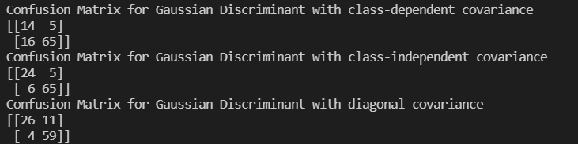

##### 3.

**The discriminant in each case was:**
-   $S_1$ and $S_2$ learned independently:
    -   ```
        -(1/2) * np.log( np.linalg.det(self.S[c]) ) - (1/2) * np.dot(Xtest[i] - self.mean[c], np.linalg.inv(self.S[c])).dot(Xtest[i] - self.mean[c]) + np.log(self.p[c])
        ```
    -   Taken from *Bayes_Parametric_Multivariate_II.pdf* page 12
        -   $g_{i}(x) = -\frac{1}{2}\log{|S_i|}-\frac{1}{2}(x-m_i)^TS_i^{-1}(x-m_i)+\log{P_{est.}(C_i)}$
            -   Classified based on a weighted distance from the mean using the covariance matrix $S$.

-   $S_1 = S_2$
    -   ```
        -(1/2) * np.log( np.linalg.det(self.S) ) - (1/2) * np.dot(Xtest[i] - self.mean[c], np.linalg.inv(self.S)).dot(Xtest[i] - self.mean[c]) + np.log(self.p[c])
        ```
    -   Taken from *Bayes_Parametric_Multivariate_II.pdf* page 12
        -   $g_{i}(x) = -\frac{1}{2}\log{|S_i|}-\frac{1}{2}(x-m_i)^TS_i^{-1}(x-m_i)+\log{P_{est.}(C_i)}$
            -   Classified based similarly to the previous assumption, but there's no indexing the covariance matrix $S$ because it's shared between classes, which leads to slightly different confusion matrices.

-   $S_1 = S_2$, Diagonal Matrix
    -   ```
        tempTerm = np.sum( np.power( (Xtest[i] - self.mean[c]) / np.sqrt(self.S) ,2 ) )
        tempList.append(-(1/2) * (tempTerm) + np.log(self.p[c]))
        ```
    -   Taken from *Bayes_Parametric_Multivariate_II.pdf* page 17
        -   $g_{i}(x) = -\frac{1}{2}\sum_{j=1}^{d}{(\frac{x_j^t-m_{ij}}{s_j}})^2+\log{P_{est.}(C_i)}$
            - Classified based on weighted Euclidean distance to the nearest mean as the diagonals are variances. This discriminant takes the sum of the normalized distances from the means by some standard deviation squared -- which is different from the first two assumptions where they take a weighted distance from the mean instead.

**Confusion matrices:**


Looking at the results of the Gaussian Discriminants, one thing to note is that the 2nd dimension of the first two matrices are the same, with values of 5 and 65. However, their first dimension differs. The reason for such a difference in the first dimension while being the same in the 2nd is because of the first term is due to having different sets of parameters, $S$ and $m$ at index $i$. What's more is that the covariances stored in $S$ from the `fit()` function contributed to such a difference.

What makes the third confusion matrix different from both of the former confusion matrices is that the discriminant function is vastly different compared to the first two, which share the same. In this discriminant function, the first term instead takes the distance a data point is from the mean and normalizes it by some standard deviation, squared, and then summed. This of course leads to a matrix that is different from the others.