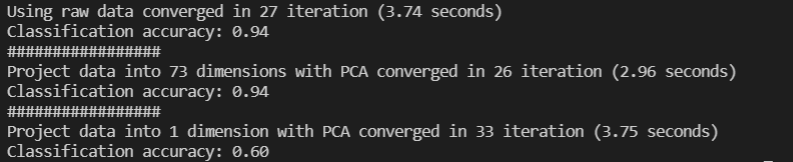
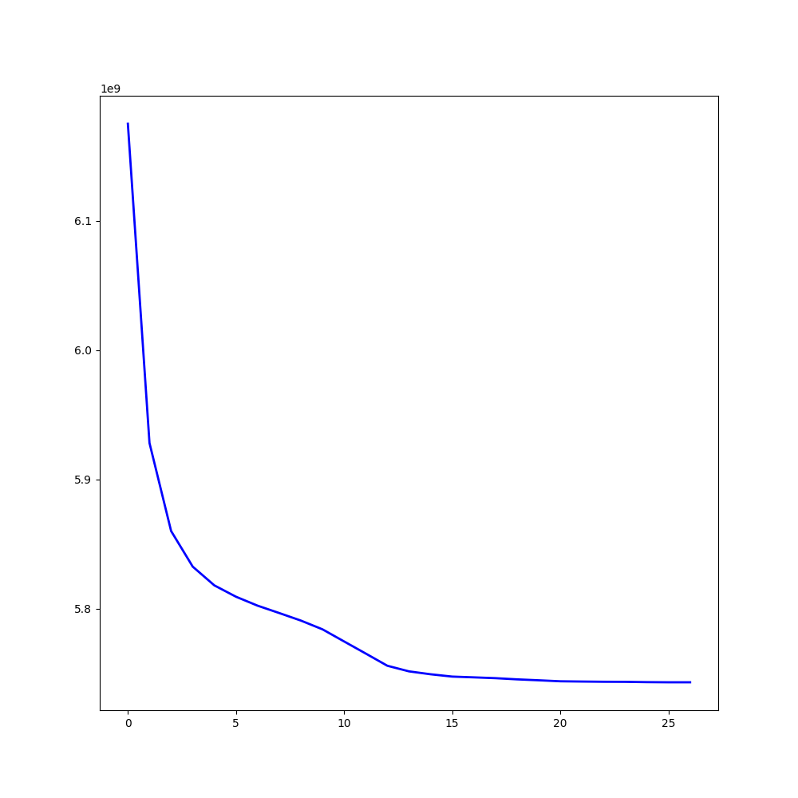
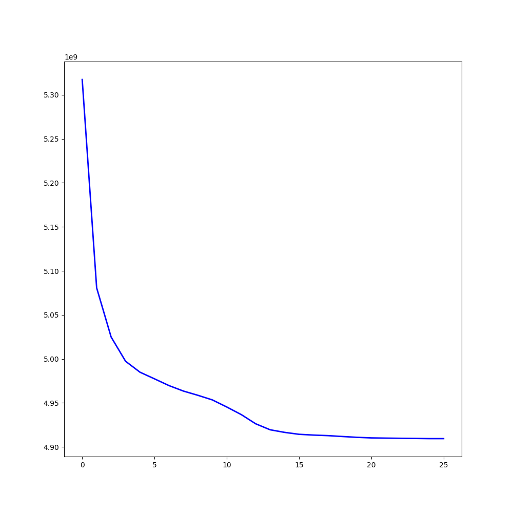
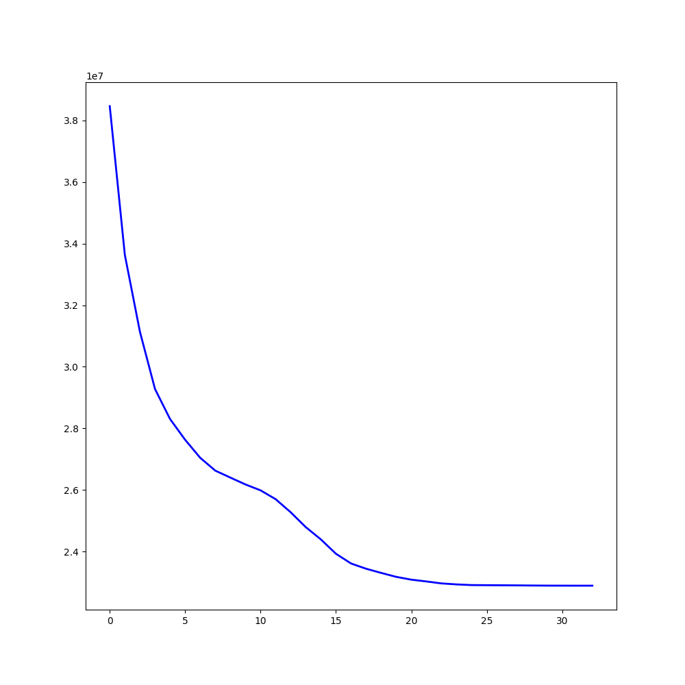

##### 3.

**Result:**

**Raw data:**

This one took 27 iterations with an accuracy of 94%.

The plot shape is kinda following what I'm expecting -- as there are more iterations, the reconstruction error decreases because the centers' variance from the data gets closer to some maximal value (i.e. J is minimizing). However, there's a small "bump" along the elbow of the curve, and I can probably guess that that's because the difference in the cluster labels changed slightly, but later on changed a reasonable bit.

**Low-dimensional data (PCA) that captures >90% of variance:**

This one took 26 iterations with an accuracy of 94%.

The shape of the curve is noticeably similar to the raw data assumption, however with PCA to help clustering, we see that the value flattens out to about 4.90 rather than about 5.7 with the previous one. So yeah, I can say that PCA helps with clustering.

**1 Principal Component**

This one took 33 iterations with an accuracy of 60%. More iterations than the last two and terribly inaccurate compared to the first two assumptions.

The results are probably terrible because there wasn't a lot of features to go off of in the training stage. Another reason is because we only took the first principal component, which corresponds to the first eigenvalue and vector. Because of that, we lose much of the information that could be used for learning -- hence the low classification accuracy. However, on the positive side, this terribleness leads to a much lower reconstruction error -- meaning that we could attempt to reconstruct the original with low loss.